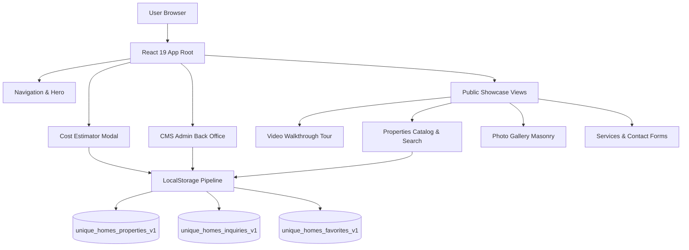

# Unique Homes & Properties — Project Documentation

## 1. Project Overview

### Purpose
**Unique Homes & Properties Ltd.** is a premier luxury real estate agency and custom architectural construction firm operating in Abuja, Nigeria (covering high-brow sectors including Maitama, Asokoro, Wuse II, Guzape, Gwarinpa, Lugbe, and Kubwa). The application serves as an enterprise-grade web platform designed to present executive property listings, showcase bespoke building capabilities, facilitate client inquiries and cost estimations, and provide a secure Back Office CMS for administrative inventory management.

### Problem Being Solved
- **Trust Deficit in High-Value Real Estate:** High-net-worth clients, diaspora investors, and corporate entities require verified property listings with transparent specifications, authentic architectural photography, and direct corporate contact channels.
- **Fragmented Property Inquiries:** Inquiries for property sales, shortlet leases, custom construction, and structural remodeling often arrive without structural specifications or realistic budget expectations.
- **Complex Inventory Maintenance:** Non-technical real estate administrators require a streamlined, accessible Back Office portal to add, update, or remove property listings and manage client leads in real time without requiring backend engineering support.

### Target Users
1. **High-Net-Worth Individuals (HNWIs) & Corporate Buyers:** Seeking luxury turnkey villas, penthouses, commercial plazas, and land plots in Abuja.
2. **Diaspora Investors:** Looking for authentic, verified construction partners and premium shortlet/leasing developments in Nigeria's capital city.
3. **Estate Managers & Real Estate Administrators:** Requiring back-office control to curate active listings, manage client inquiries, and track sales pipelines.

### Success Criteria
- **Pristine Visual Hierarchy:** Clean, executive light layout reflecting luxury architectural principles (Deep Navy `#121A2D`, Warm Gold `#D4AF37`, Off-White `#F5F5F0`).
- **Interactive Property Search & Filter:** Instant zero-latency search by location, property type, price range, bedrooms, and status.
- **Integrated Estimator & Lead Generation:** Instant quote generation for structural construction and property acquisition linked directly to the back-office inquiry log.
- **Embedded CMS/Back Office Gate:** Full CRUD management for properties and inquiry status tracking with local persistence fallback.
- **Standardized Static Asset Pipeline:** Clean TypeScript image module resolution (`src/assets/images/`) enabling simple drop-in asset replacement for local developer teams.

---

## 2. Final Deliverables

### Completed Components & Architecture
- **Navigation (`src/components/Navigation.tsx`):** Sticky header with brand identity, desktop & mobile drawer navigation, section scroll highlighting, quick quote launcher, and Back Office gate link.
- **Hero Showcase (`src/components/Hero.tsx`):** Executive introductory banner with headline display typography, key trust metrics, primary CTAs, and main architectural image showcase.
- **Video Walkthrough Tour (`src/components/VideoTour.tsx`):** Interactive HTML5/MP4 video player with custom play/pause/mute controls, full-screen mode, interactive duration bar, and high-resolution poster frame.
- **About Corporate & Founder Profile (`src/components/About.tsx`):** Corporate story, company core pillars, and interactive founder bio modal featuring Dr. Noah.
- **Services Showcase (`src/components/Services.tsx`):** Detailed corporate service breakdown (Sales, Leasing, Construction, Remodeling) with direct inquiry preset triggers.
- **Properties Catalog & Filtering (`src/components/Properties.tsx`):** Multi-faceted search bar, filter tabs, sorting options, interactive detail modal, wishlist/favorites toggle, and direct inquiry form.
- **Photo Gallery Masonry (`src/components/Gallery.tsx`):** Interactive masonry lightbox showcasing completed villas, interiors, apartments, and construction site progress.
- **Performance Statistics (`src/components/Stats.tsx`):** Key corporate milestones (350+ properties delivered, ₦120B+ portfolio value, 99.4% client satisfaction).
- **Client Testimonials (`src/components/Testimonials.tsx`):** Interactive slide/tab testimonial showcase from diplomats, corporate executives, and diaspora investors.
- **FAQs Accordion (`src/components/FAQs.tsx`):** Categorized collapsible accordion addressing titles (C of O), payment plans, inspections, and custom build timelines.
- **Contact Core (`src/components/Contact.tsx`):** Lead contact form with service pre-filling, direct call buttons, office map location, and social links.
- **Back Office CMS (`src/components/CMS.tsx`):** Full administrative dashboard featuring property creation/editing/deletion, visual preset selector, inquiry lead inbox, and status management.
- **Cost Estimator Modal (`src/App.tsx`):** Modal dialog for project estimation quotes, budget selection, and automated inquiry dispatch.
- **Footer (`src/components/Footer.tsx`):** Corporate footer with navigational links, quick contact info, copyright, and secret back office access trigger.
- **Static Asset Module Pipeline (`src/assets/images/*` & `src/vite-env.d.ts`):** Complete module-mapped image structure allowing clean drop-in local image file replacement.

### Intentionally Excluded
- **Payment Gateway Integration (Stripe/Paystack):** Real estate acquisitions in Abuja rely on bank wires, certified escrow transfers, or milestone legal agreements. Online card checkout was excluded to align with industry compliance.
- **Live Server Database (Cloud SQL/Firestore):** Client requested a self-contained prototype architecture with robust client-side `localStorage` caching for instant offline demonstration.

---

## 3. Architecture & Technical Decisions

### Technology Stack
- **Framework:** React 19 with TypeScript 5.8
- **Build Tool / Bundler:** Vite 6.2 with `@tailwindcss/vite` plugin
- **Styling:** Tailwind CSS v4 with custom brand color extensions (`brand-navy`, `brand-gold`, `brand-gold-hover`, `brand-border`)
- **Iconography:** Lucide React (`lucide-react`)
- **Type Checking:** TypeScript with strict type definitions (`src/types.ts`) and Vite client types declaration (`src/vite-env.d.ts`)



### Folder Structure
```
/
├── index.html                    # Root HTML document with SEO meta titles
├── metadata.json                 # Platform metadata & permissions configuration
├── package.json                  # Dependencies, dev scripts & build pipeline
├── tsconfig.json                 # TypeScript compiler options
├── vite.config.ts                # Vite bundler configuration with Tailwind plugin
├── src/
│   ├── main.tsx                  # React DOM entry point
│   ├── App.tsx                   # Main state container & router layout
│   ├── index.css                 # Global Tailwind CSS imports & theme directives
│   ├── types.ts                  # Shared interfaces (Property, Inquiry, Testimonial, FAQ)
│   ├── data.ts                   # Initial property inventory & static content
│   ├── vite-env.d.ts             # Vite client module type declarations
│   ├── assets/
│   │   └── images/               # Modularized image assets repository
│   └── components/
│       ├── Navigation.tsx        # Header & mobile drawer
│       ├── Hero.tsx              # Hero showcase banner
│       ├── VideoTour.tsx         # Interactive video player
│       ├── About.tsx             # Corporate overview & founder profile modal
│       ├── Services.tsx          # Service offerings & quote triggers
│       ├── Properties.tsx        # Filterable property grid & detail modal
│       ├── Gallery.tsx           # Photo gallery with modal lightbox
│       ├── Stats.tsx             # Key achievements & metrics
│       ├── Testimonials.tsx      # Client reviews carousel
│       ├── FAQs.tsx              # Collapsible support accordion
│       ├── Contact.tsx           # Lead intake form & office contacts
│       ├── CMS.tsx               # Admin Back Office inventory dashboard
│       └── Footer.tsx            # Corporate footer & legal links
```

### Major Implementation Decisions & Trade-offs

1. **Top-Level Static Asset Imports vs. Hardcoded Remote URLs**
   - *Decision:* Refactored all image references across components and data definitions to use top-level ES module imports from `src/assets/images/`.
   - *Rationale:* Allows developers to clone the repository and simply drop their local high-resolution assets into `src/assets/images/` using standardized file names (`hero-showcase.jpg`, `property-grand-pavilion.jpg`, etc.) without altering code logic.

2. **Client-Side LocalStorage Fallback Pipeline**
   - *Decision:* Implemented a state synchronization hook that seeds initial property listings and inquiries into browser `localStorage`, preserving any user-added properties or submitted inquiries across browser refreshes.
   - *Rationale:* Guarantees high reactivity and instant zero-latency feedback during client demonstrations without requiring active server endpoints or database setup.

3. **Single-Page Scroll Navigation with Dynamic Active Highlighting**
   - *Decision:* Utilized smooth window scrolling calculations offset by header height (88px) combined with scroll event listeners to dynamically highlight active navigation links.
   - *Rationale:* Delivers a continuous storytelling experience for executive visitors while allowing instant jumping to specific sections.

---

## 4. Design System

### Colors
- **Brand Navy (`#121A2D`):** Primary background for executive bars, footers, dark modals, and primary typography.
- **Brand Gold (`#D4AF37`):** Accent color reserved for key actions, badges, highlights, and borders.
- **Brand Gold Hover (`#B89628`):** Darker gold variant for hover and focus states.
- **Light Canvas (`#FFFFFF` / `#F5F5F0`):** Soft, high-contrast background off-whites to reduce eyestrain and enhance readability.
- **Brand Border (`#E5E5E0`):** Hairline borders providing structured separation without heavy drop shadows.

### Typography
- **Headings:** Modern Display Sans with bold weights and generous tracking for executive framing.
- **Body:** System Sans-Serif font stack with strict baseline ratios (`line-height: 1.5 - 1.7`).
- **Data & Numbers:** Monospaced font family for currency (`NGN / ₦`), square meters (`sqm`), dates, and telephone contacts.

### Spacing & Padding
- **Outer Padding:** Main container padding scales from `px-6` (mobile) to `px-12` (desktop) with max width capped at `max-w-7xl`.
- **Card Nesting:** Follows mathematical inner radius calculations (`Inner Radius = Outer Radius - Padding`) to eliminate visual awkwardness.

---

## 5. Features Documentation

### 1. Navigation Header
- **Purpose:** Provide persistent corporate navigation, mobile drawer access, and quick access to Back Office features.
- **Behavior:** Features glassmorphism background blur on scroll, section active indicator, direct button to project estimator, and secret admin toggle.

### 2. Hero Showcase
- **Purpose:** Set the executive tone for Unique Homes & Properties Ltd.
- **Behavior:** Displays brand value propositions, key statistics (350+ completed projects), CTA links to properties and video walkthroughs, and primary exterior imagery.

### 3. Interactive Video Walkthrough
- **Purpose:** Offer an immersive video tour of featured luxury properties.
- **Behavior:** Custom HTML5 video player supporting play/pause toggling, volume control, time scrub bar, fullscreen mode, and fallback poster frame (`video-poster.jpg`).

### 4. About Corporate & Founder Profile
- **Purpose:** Establish trust and highlight leadership credentials.
- **Behavior:** Features corporate pillars (Engineering, Trust, Speed) and an interactive modal presenting Dr. Noah's bio and achievements.

### 5. Services Showcase
- **Purpose:** Present core business offerings (Sales, Leasing, Custom Construction, Remodeling).
- **Behavior:** Clicking "Request Service Inquiry" pre-selects the chosen service and scrolls smoothly to the contact form.

### 6. Filterable Property Catalog
- **Purpose:** Comprehensive search and discovery platform for properties across Abuja.
- **Behavior:** Real-time filtering by property status (All, For Sale, For Rent, Under Construction, Land Plot), search query, location filter, bedroom count filter, and sorting (Price High-Low, Price Low-High, Newest). Includes interactive detail view modal and wishlist bookmarking.

### 7. Photo Gallery Masonry
- **Purpose:** Display high-resolution photography of completed developments and construction progress.
- **Behavior:** Filterable category tabs (All, Villas, Apartments, Interiors, Construction) with interactive lightbox modal for expanded viewing.

### 8. Back Office CMS Portal
- **Purpose:** Administrative interface for real estate staff.
- **Behavior:** Features full CRUD for property listings (title, price, location, bedrooms, bathrooms, size, status, image preset, specifications, featured flag) and real-time client inquiry management (status updates from "New" to "Contacted" or "Closed").

### 9. Project Cost Estimator Modal
- **Purpose:** Direct estimation tool for custom construction and property acquisitions.
- **Behavior:** Captures user specifications, budget ranges (₦35M to ₦600M+), project types, and dispatches leads directly to the CMS inquiry queue.

---

## 6. Files & Codebase Reference

| File Path | Role & Purpose |
| :--- | :--- |
| `index.html` | Entry HTML document containing title and viewport settings. |
| `metadata.json` | Platform application metadata and frame permissions. |
| `package.json` | Project dependencies (`react`, `vite`, `lucide-react`, `motion`, `tailwindcss`). |
| `tsconfig.json` | Compiler options and TypeScript rules. |
| `vite.config.ts` | Vite bundler config integrating `@tailwindcss/vite`. |
| `src/main.tsx` | App bootstrapper mounting `App` into DOM `#root`. |
| `src/App.tsx` | Main application shell managing global state, `localStorage` caching, section routing, and cost estimator modal. |
| `src/types.ts` | Core TypeScript interfaces (`Property`, `Inquiry`, `Testimonial`, `FAQ`). |
| `src/data.ts` | Default initial property listings, testimonials, and FAQs. |
| `src/vite-env.d.ts` | Module declarations for importing image files in TypeScript. |
| `src/assets/images/*` | Static image files repository for standard component image imports. |
| `src/components/Navigation.tsx` | Responsive header navigation and admin trigger. |
| `src/components/Hero.tsx` | High-impact hero section with key stats. |
| `src/components/VideoTour.tsx` | Custom HTML5 video walkthrough player. |
| `src/components/About.tsx` | Corporate background and founder bio modal. |
| `src/components/Services.tsx` | Business service cards with quick inquiry presets. |
| `src/components/Properties.tsx` | Interactive property search, filter, wishlist, and modal. |
| `src/components/Gallery.tsx` | Photo gallery grid with lightbox modal. |
| `src/components/Stats.tsx` | Achievement statistics display. |
| `src/components/Testimonials.tsx` | Client reviews component. |
| `src/components/FAQs.tsx` | Accordion for client questions. |
| `src/components/Contact.tsx` | Lead contact intake form. |
| `src/components/CMS.tsx` | Back Office administrative dashboard for property and lead management. |
| `src/components/Footer.tsx` | Main site footer with corporate links. |

---

## 7. Decisions Log

| Date | Decision | Alternatives Considered | Rationale |
| :--- | :--- | :--- | :--- |
| **2026-07-21** | Modular image assets with standard TypeScript imports | Remote Unsplash URLs | Ensured developer could replace image files locally by dropping files into `src/assets/images/`. |
| **2026-07-21** | `localStorage` persistence layer | In-memory React state | Preserved user CRUD edits and submitted inquiries across refreshes without requiring external database setup. |
| **2026-07-21** | Tailwind CSS v4 setup via `@tailwindcss/vite` | Classic PostCSS config | Simplified build process and improved compilation speed inside Vite environment. |
| **2026-07-21** | Integrated CMS modal inside single-page architecture | Separate multi-page route structure | Allowed instant switching between client view and Back Office without full page reloads. |

---

## 8. Known Issues & Limitations

1. **Local State Persistence Boundary:** Currently, properties and inquiries modified in the CMS are saved to browser `localStorage`. Clearing browser storage resets data to `INITIAL_PROPERTIES`.
2. **Video Asset Hosting:** The video walkthrough uses a public sample stream URL (`mixkit.co`). For production deployment, host high-definition MP4 files on a dedicated CDN or video service (e.g., Cloudflare Stream / Vimeo Pro).
3. **Authentication Security:** The Back Office toggle is currently an open gate designed for immediate demonstration. In production, protect `/admin` with Firebase Auth or OAuth 2.0.

---

## 9. Future Roadmap

### Immediate Steps (1 - 2 Weeks)
- Drop local high-resolution client property photographs into `src/assets/images/`.
- Connect contact form dispatch to an email API service (e.g., SendGrid or Resend) for real-time inbox notifications.

### Short-Term (1 - 2 Months)
- Integrate Firebase Firestore or Cloud SQL (via Drizzle ORM) for multi-user real-time database synchronization.
- Implement Firebase Authentication with role-based access control (RBAC) for the CMS portal.

### Long-Term (3 - 6 Months)
- Add 3D Virtual Tour integrations (Matterport / 360° Panorama Viewer).
- Implement interactive CAD floor plan views and automated PDF brochure generator for properties.

---

## 10. Development Environment & Deployment

### Local Setup Instructions
1. **Clone & Install Dependencies:**
   ```bash
   npm install
   ```
2. **Run Development Server:**
   ```bash
   npm run dev
   ```
   *The server will start at `http://localhost:3000`.*

3. **Code Linting & Verification:**
   ```bash
   npm run lint
   npm run build
   ```

### Production Deployment (Vercel / Cloud Run)
- **Live Demo Site:** [https://unique-homes-demo-one.vercel.app/](https://unique-homes-demo-one.vercel.app/)
- **Build Output Directory:** `dist/`
- **Build Command:** `npm run build`

---

## 11. Lessons Learned

- **Top-level static asset imports in Vite** guarantee that image paths are properly hashed and bundled during production builds, eliminating broken image links.
- **Consistent brand color tokens** (`brand-navy`, `brand-gold`) ensure visual coherence across dark hero sections, light property cards, and administrative tables.
- **Pre-seeded data structures** make administrative dashboards immediately engaging for preview and client review without empty states.

---

## 12. AI Handoff Instructions

> **Notice for Successor AI Agents:**
> 1. All component image imports **must** remain top-level ES module imports from `src/assets/images/`.
> 2. When adding new components, declare any new property or inquiry properties in `src/types.ts` first.
> 3. Verify TypeScript validity using `npm run lint` before committing changes.
> 4. Keep styling strictly aligned with the established Tailwind palette (`brand-navy: #121A2D`, `brand-gold: #D4AF37`, `brand-border: #E5E5E0`).

---

## 13. Executive Summary

**Unique Homes & Properties Ltd.** is a web application built for Abuja's premier real estate and custom construction company. It features a responsive property catalog with multi-criteria search and filtering, an interactive video tour, a project cost estimator, and an integrated Back Office CMS for property and lead management. Built with **React 19, TypeScript, and Tailwind CSS v4**, the application is optimized for performance, accessibility, and clean asset management.
